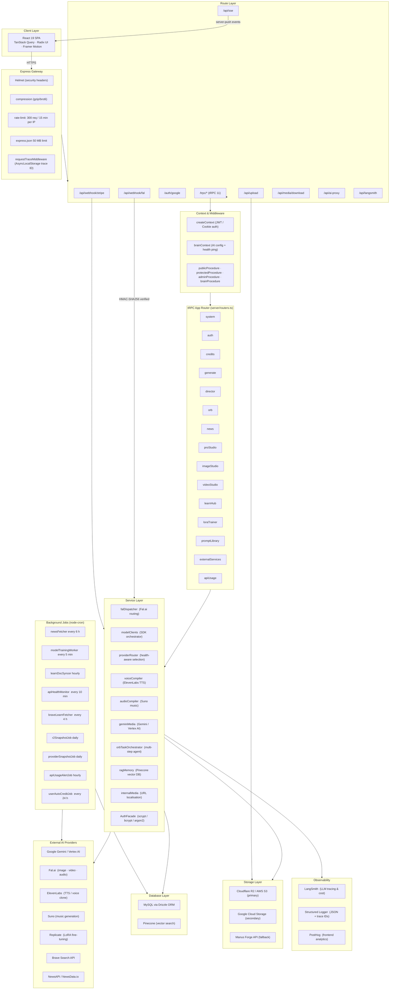
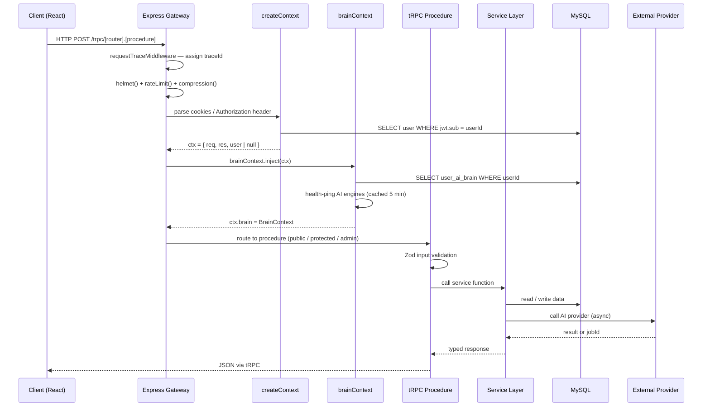
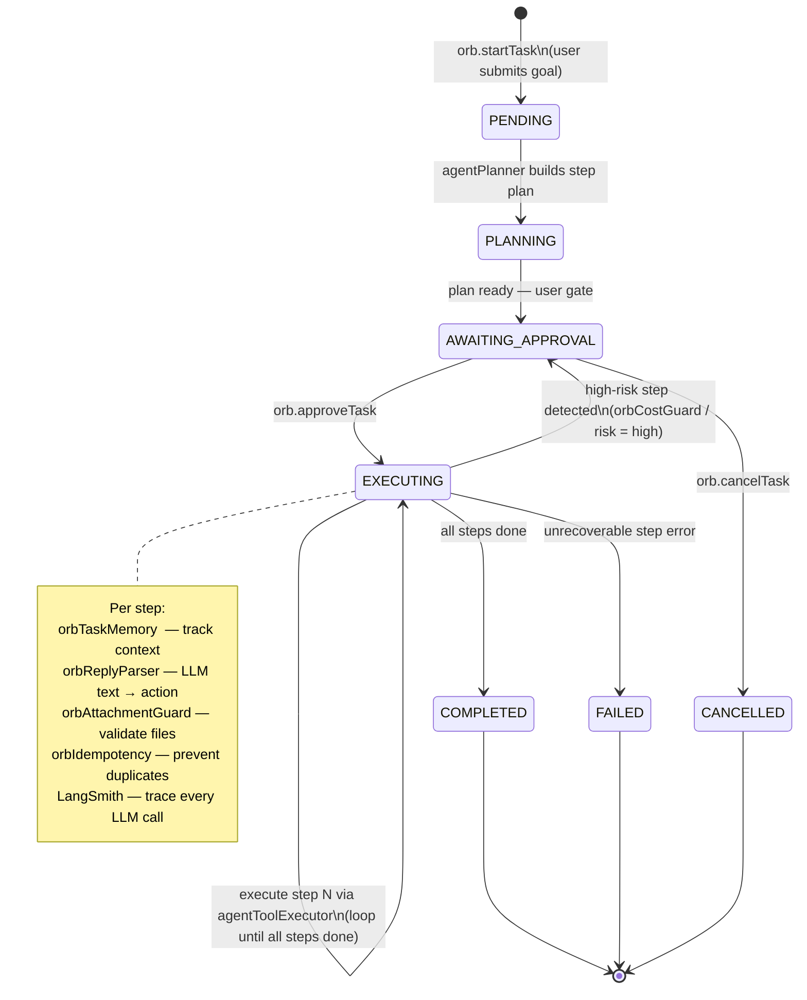
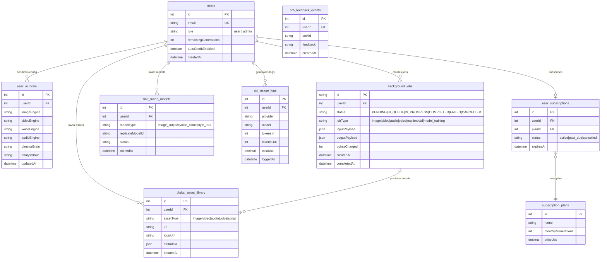

# Healing Studio — Complete Backend Pipeline Diagrams

This document contains 8 layered Mermaid diagrams covering the full backend pipeline.

---

## 1. Overall System Architecture



---

## 2. Request Lifecycle



---

## 3. AI Generation Pipeline

```mermaid
flowchart TD
  A([Client requests generation]) --> B["generate.prepareJob"]
  B --> B1{Enough credits?}
  B1 -->|No| ERR1([Error: insufficient credits])
  B1 -->|Yes| B2["Estimate points via modelPricing\n(100 pts ≈ $1 USD)"]
  B2 --> B3["Deduct remainingGenerations"]
  B3 --> B4["INSERT backgroundJob\nstatus = PENDING"]
  B4 --> C([Return jobId to client])

  C --> D["generate.executeJob(jobId)"]
  D --> D1["Load user brain config from brainContext"]
  D1 --> D2["providerRouter: select best engine\nbased on health + user preference"]
  D2 --> D3{Engine type?}

  D3 -->|image|      E1["falDispatcher → Fal.ai\nFlux Pro / Schnell"]
  D3 -->|video|      E2["falDispatcher → Fal.ai\nVideo models"]
  D3 -->|audio|      E3["audioCompiler → Suno"]
  D3 -->|voice/TTS|  E4["voiceCompiler → ElevenLabs"]
  D3 -->|multimodal| E5["geminiMedia → Gemini / Vertex AI"]
  D3 -->|LoRA train| E6["Replicate API — queue job"]

  E1 & E2 & E3 & E4 & E5 & E6 --> F["UPDATE backgroundJob\nstatus = IN_QUEUE / IN_PROGRESS"]

  F --> G([Client polls generate.getJobStatus])
  G --> G1{Status?}
  G1 -->|IN_PROGRESS| G
  G1 -->|FAILED|      ERR2([Return error · refund credits])
  G1 -->|COMPLETED|   H["generate.getJobResult"]

  subgraph WEBHOOK["Async Webhook — Fal.ai only"]
    W1["POST /api/webhook/fal"]
    W2["HMAC-SHA256 verify signature"]
    W3["internalMedia.localize\nCDN URLs → S3 / GCS"]
    W4["UPDATE backgroundJob COMPLETED\nPersist asset URLs"]
    W1 --> W2 --> W3 --> W4
  end

  E1 & E2 -->|webhook callback| WEBHOOK

  H --> H1["Return localised asset URLs"]
  H1 --> H2["INSERT digital_asset_library"]
  H2 --> I([Asset displayed in client])
```

---

## 4. Orb Agent System — State Machine



---

## 5. Background Jobs — Cron Schedule

```mermaid
gantt
  title Background Jobs (24-hour window)
  dateFormat HH:mm
  axisFormat %H:%M

  section Every 5 min
  modelTrainingWorker    :active, t1, 00:00, 5m

  section Every 10 min
  apiHealthMonitor       :active, t2, 00:00, 10m

  section Hourly
  learnDocSyncer         :t3, 00:00, 60m
  apiUsageAlertJob       :t4, 00:30, 60m

  section Every 4 h
  braveLearnFetcher      :t5, 00:00, 240m

  section Every 6 h
  newsFetcher            :t6, 00:00, 360m

  section Daily
  userAutoCreditJob      :t7, 00:00, 24h
  r2SnapshotJob          :t8, 02:00, 24h
  providerSnapshotJob    :t9, 02:30, 24h
```



> All jobs use an `isRunning` guard flag to prevent overlapping executions.

---

## 6. Database Schema — Core Tables (ERD)



---

## 7. Storage Layer — Backend Selection

```mermaid
flowchart TD
  A([storagePut / storageGet called]) --> B{Which env vars are set?}

  B -->|R2_ACCOUNT_ID or AWS_* vars|            C["Cloudflare R2 / AWS S3\nAWS Signature v4 (manual, zero deps)"]
  B -->|GOOGLE_APPLICATION_CREDENTIALS_JSON|    D["Google Cloud Storage\nService Account auth"]
  B -->|MANUS_FORGE_URL|                         E["Manus Forge API\nlegacy HTTP upload"]

  C --> F["Presigned URL — PUT"]
  C --> G["Presigned URL — GET"]
  C --> H["Multipart upload  > 5 MB"]

  D --> I["GCS streaming upload"]
  D --> J["GCS signed URL"]

  E --> K["HTTP multipart POST"]

  F & G & H & I & J & K --> L(["Return { key, url }"])

  L --> M["internalMedia.localize\nstore local URL in DB\nproxy CDN → local storage"]
```

---

## 8. Authentication Flow

```mermaid
sequenceDiagram
  participant C    as Client
  participant GW   as Express
  participant OA   as Google OAuth 2.0
  participant AUTH as AuthFacade
  participant DB   as MySQL
  participant JWT  as JWT Service

  Note over C,JWT: Google OAuth login
  C->>GW: GET /auth/google
  GW->>OA: redirect to Google consent screen
  OA-->>GW: GET /auth/google/callback?code=…
  GW->>OA: exchange code for tokens
  OA-->>GW: { access_token, id_token }
  GW->>AUTH: upsertGoogleUser(profile)
  AUTH->>DB: SELECT / INSERT users WHERE googleId
  DB-->>AUTH: user record
  AUTH->>JWT: sign({ sub: userId }, JWT_SECRET, 365 d)
  JWT-->>GW: token string
  GW-->>C: Set-Cookie: token=…; HttpOnly; Secure

  Note over C,JWT: Subsequent authenticated request
  C->>GW: POST /trpc/…  Cookie: token=…
  GW->>JWT: verify(token, JWT_SECRET)
  JWT-->>GW: { sub: userId }
  GW->>DB: SELECT user WHERE id = userId
  DB-->>GW: user record (role, credits, …)
  GW->>GW: ctx.user = user
  GW->>GW: protectedProcedure asserts ctx.user !== null
```

---

## Critical File Reference

| File | Role |
|------|------|
| `server/_core/index.ts` | Server bootstrap, route registration, cron init |
| `server/routers.ts` | tRPC app router — all API endpoints (6 000+ lines) |
| `server/_core/context.ts` | JWT / OAuth auth, `createContext` |
| `server/middleware/brainContext.ts` | AI brain config injection + health checks |
| `server/db.ts` | MySQL pool init (Drizzle ORM) |
| `server/storage.ts` | Multi-backend storage abstraction |
| `server/services/falDispatcher.ts` | Fal.ai model dispatch + fallback |
| `server/services/modelClients.ts` | SDK orchestrator (`SafeApiCaller` + all providers) |
| `server/services/providerRouter.ts` | Health-aware provider selection |
| `server/services/orbTaskOrchestrator.ts` | Orb multi-step agent coordinator |
| `server/routes/webhookFal.ts` | Async Fal.ai result ingestion |
| `drizzle/schema.ts` | Full database schema |
| `server/jobs/*.ts` | All background cron jobs |
