# Healing Studio — Complete Backend Pipeline Diagrams

This document contains 8 layered Mermaid diagrams covering the full backend pipeline.

---

## 1. Overall System Architecture

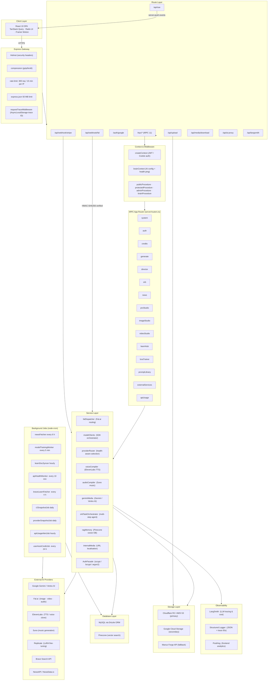

---

## 2. Request Lifecycle

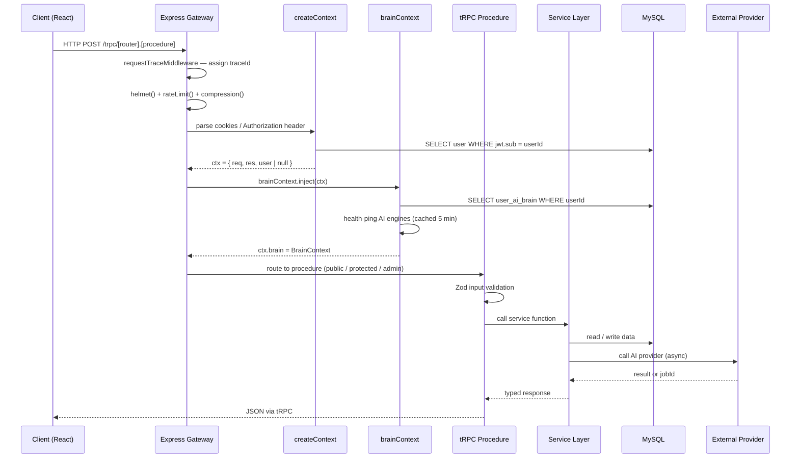

---

## 3. AI Generation Pipeline

```mermaid
flowchart TD
  A([Client requests generation]) --> B["generate.prepareJob"]
  B --> B1{Enough credits?}
  B1 -->|No| ERR1([Error: insufficient credits])
  B1 -->|Yes| B2["Estimate points via modelPricing\n(100 pts ≈ $1 USD)"]
  B2 --> B3["Deduct remainingGenerations"]
  B3 --> B4["INSERT backgroundJob\nstatus = PENDING"]
  B4 --> C([Return jobId to client])

  C --> D["generate.executeJob(jobId)"]
  D --> D1["Load user brain config from brainContext"]
  D1 --> D2["providerRouter: select best engine\nbased on health + user preference"]
  D2 --> D3{Engine type?}

  D3 -->|image|      E1["falDispatcher → Fal.ai\nFlux Pro / Schnell"]
  D3 -->|video|      E2["falDispatcher → Fal.ai\nVideo models"]
  D3 -->|audio|      E3["audioCompiler → Suno"]
  D3 -->|voice/TTS|  E4["voiceCompiler → ElevenLabs"]
  D3 -->|multimodal| E5["geminiMedia → Gemini / Vertex AI"]
  D3 -->|LoRA train| E6["Replicate API — queue job"]

  E1 & E2 & E3 & E4 & E5 & E6 --> F["UPDATE backgroundJob\nstatus = IN_QUEUE / IN_PROGRESS"]

  F --> G([Client polls generate.getJobStatus])
  G --> G1{Status?}
  G1 -->|IN_PROGRESS| G
  G1 -->|FAILED|      ERR2([Return error · refund credits])
  G1 -->|COMPLETED|   H["generate.getJobResult"]

  subgraph WEBHOOK["Async Webhook — Fal.ai only"]
    W1["POST /api/webhook/fal"]
    W2["HMAC-SHA256 verify signature"]
    W3["internalMedia.localize\nCDN URLs → S3 / GCS"]
    W4["UPDATE backgroundJob COMPLETED\nPersist asset URLs"]
    W1 --> W2 --> W3 --> W4
  end

  E1 & E2 -->|webhook callback| WEBHOOK

  H --> H1["Return localised asset URLs"]
  H1 --> H2["INSERT digital_asset_library"]
  H2 --> I([Asset displayed in client])
```

---

## 4. Orb Agent System — State Machine

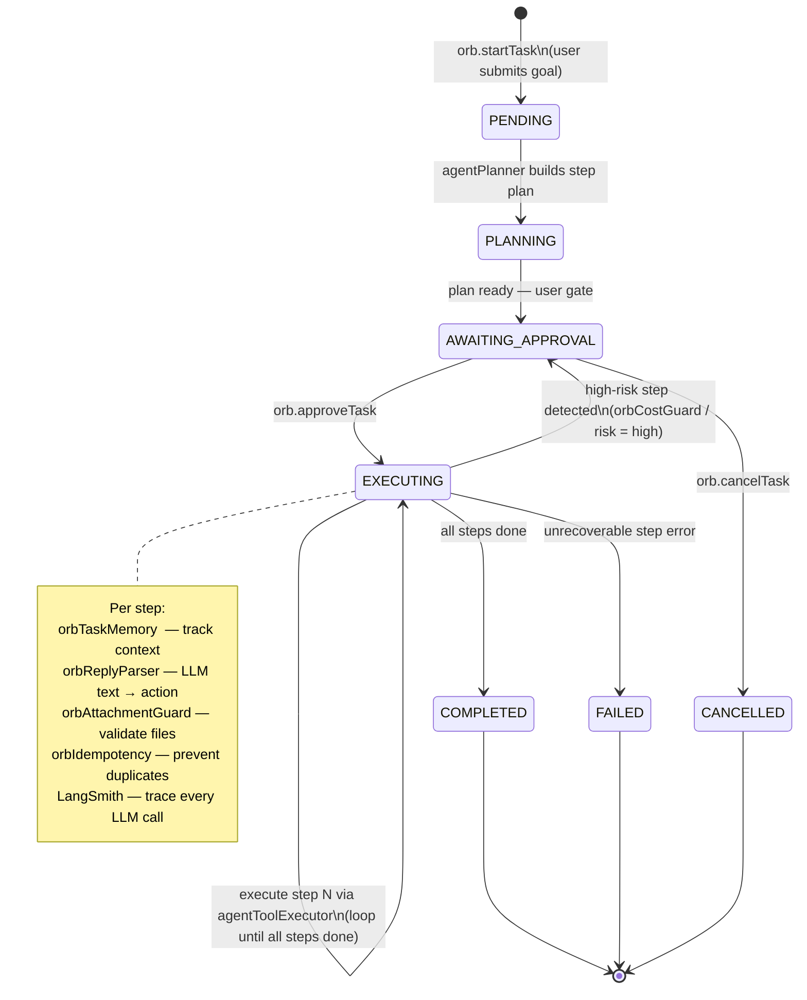

---

## 5. Background Jobs — Cron Schedule

```mermaid
gantt
  title Background Jobs (24-hour window)
  dateFormat HH:mm
  axisFormat %H:%M

  section Every 5 min
  modelTrainingWorker    :active, t1, 00:00, 5m

  section Every 10 min
  apiHealthMonitor       :active, t2, 00:00, 10m

  section Hourly
  learnDocSyncer         :t3, 00:00, 60m
  apiUsageAlertJob       :t4, 00:30, 60m

  section Every 4 h
  braveLearnFetcher      :t5, 00:00, 240m

  section Every 6 h
  newsFetcher            :t6, 00:00, 360m

  section Daily
  userAutoCreditJob      :t7, 00:00, 24h
  r2SnapshotJob          :t8, 02:00, 24h
  providerSnapshotJob    :t9, 02:30, 24h
```

> All jobs use an `isRunning` guard flag to prevent overlapping executions.

---

## 6. Database Schema — Core Tables (ERD)

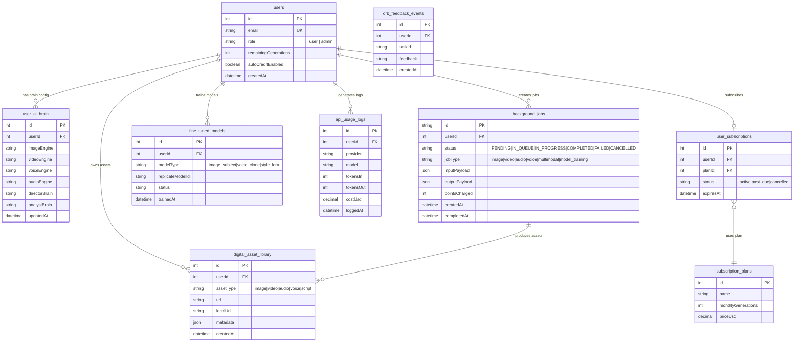

---

## 7. Storage Layer — Backend Selection

```mermaid
flowchart TD
  A([storagePut / storageGet called]) --> B{Which env vars are set?}

  B -->|R2_ACCOUNT_ID or AWS_* vars|            C["Cloudflare R2 / AWS S3\nAWS Signature v4 (manual, zero deps)"]
  B -->|GOOGLE_APPLICATION_CREDENTIALS_JSON|    D["Google Cloud Storage\nService Account auth"]
  B -->|MANUS_FORGE_URL|                         E["Manus Forge API\nlegacy HTTP upload"]

  C --> F["Presigned URL — PUT"]
  C --> G["Presigned URL — GET"]
  C --> H["Multipart upload  > 5 MB"]

  D --> I["GCS streaming upload"]
  D --> J["GCS signed URL"]

  E --> K["HTTP multipart POST"]

  F & G & H & I & J & K --> L(["Return { key, url }"])

  L --> M["internalMedia.localize\nstore local URL in DB\nproxy CDN → local storage"]
```

---

## 8. Authentication Flow

```mermaid
sequenceDiagram
  participant C    as Client
  participant GW   as Express
  participant OA   as Google OAuth 2.0
  participant AUTH as AuthFacade
  participant DB   as MySQL
  participant JWT  as JWT Service

  Note over C,JWT: Google OAuth login
  C->>GW: GET /auth/google
  GW->>OA: redirect to Google consent screen
  OA-->>GW: GET /auth/google/callback?code=…
  GW->>OA: exchange code for tokens
  OA-->>GW: { access_token, id_token }
  GW->>AUTH: upsertGoogleUser(profile)
  AUTH->>DB: SELECT / INSERT users WHERE googleId
  DB-->>AUTH: user record
  AUTH->>JWT: sign({ sub: userId }, JWT_SECRET, 365 d)
  JWT-->>GW: token string
  GW-->>C: Set-Cookie: token=…; HttpOnly; Secure

  Note over C,JWT: Subsequent authenticated request
  C->>GW: POST /trpc/…  Cookie: token=…
  GW->>JWT: verify(token, JWT_SECRET)
  JWT-->>GW: { sub: userId }
  GW->>DB: SELECT user WHERE id = userId
  DB-->>GW: user record (role, credits, …)
  GW->>GW: ctx.user = user
  GW->>GW: protectedProcedure asserts ctx.user !== null
```

---

## Critical File Reference

| File | Role |
|------|------|
| `server/_core/index.ts` | Server bootstrap, route registration, cron init |
| `server/routers.ts` | tRPC app router — all API endpoints (6 000+ lines) |
| `server/_core/context.ts` | JWT / OAuth auth, `createContext` |
| `server/middleware/brainContext.ts` | AI brain config injection + health checks |
| `server/db.ts` | MySQL pool init (Drizzle ORM) |
| `server/storage.ts` | Multi-backend storage abstraction |
| `server/services/falDispatcher.ts` | Fal.ai model dispatch + fallback |
| `server/services/modelClients.ts` | SDK orchestrator (`SafeApiCaller` + all providers) |
| `server/services/providerRouter.ts` | Health-aware provider selection |
| `server/services/orbTaskOrchestrator.ts` | Orb multi-step agent coordinator |
| `server/routes/webhookFal.ts` | Async Fal.ai result ingestion |
| `drizzle/schema.ts` | Full database schema |
| `server/jobs/*.ts` | All background cron jobs |

---

## 9. LLM Engine Routing & Circuit Breaker

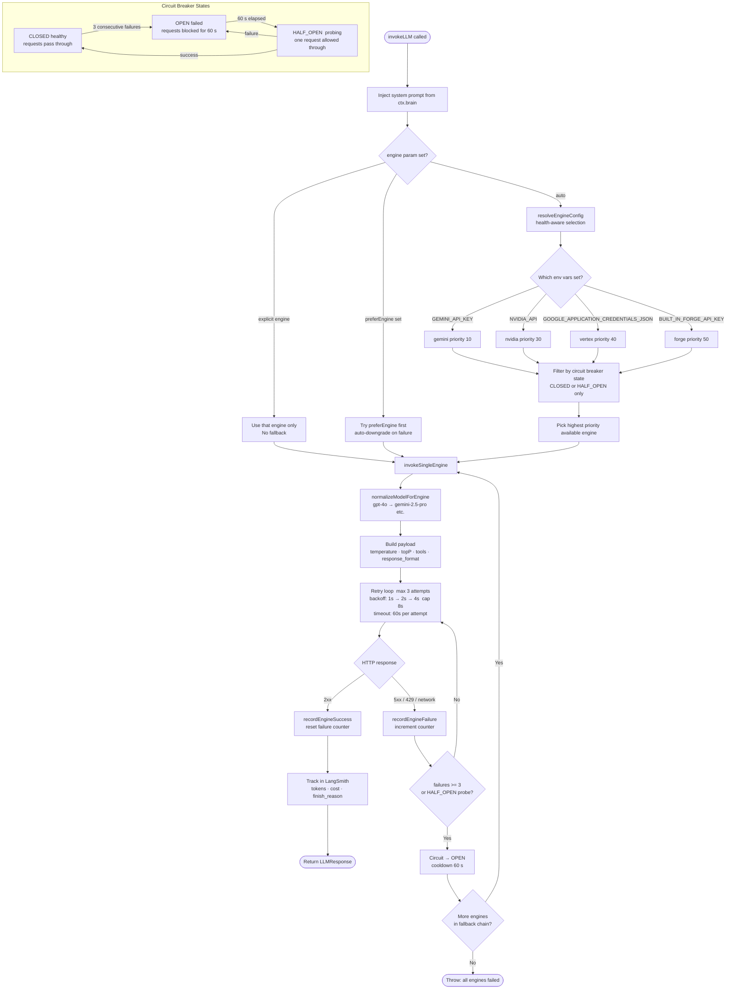

---

## 10. Brain Context Middleware — Detailed Flow

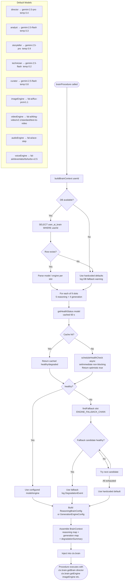

---

## 11. Complete tRPC Router Map

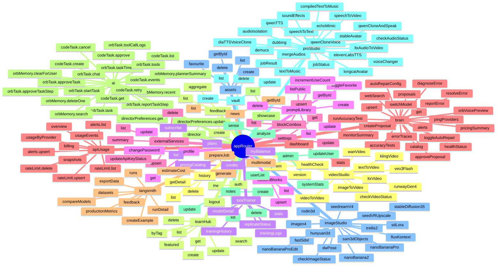

---

## 12. Model Pricing & Points Estimation

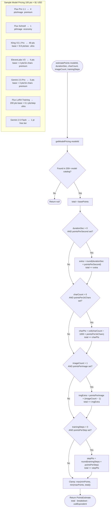

---

## 13. Provider Selection Algorithm (Intent-Based)

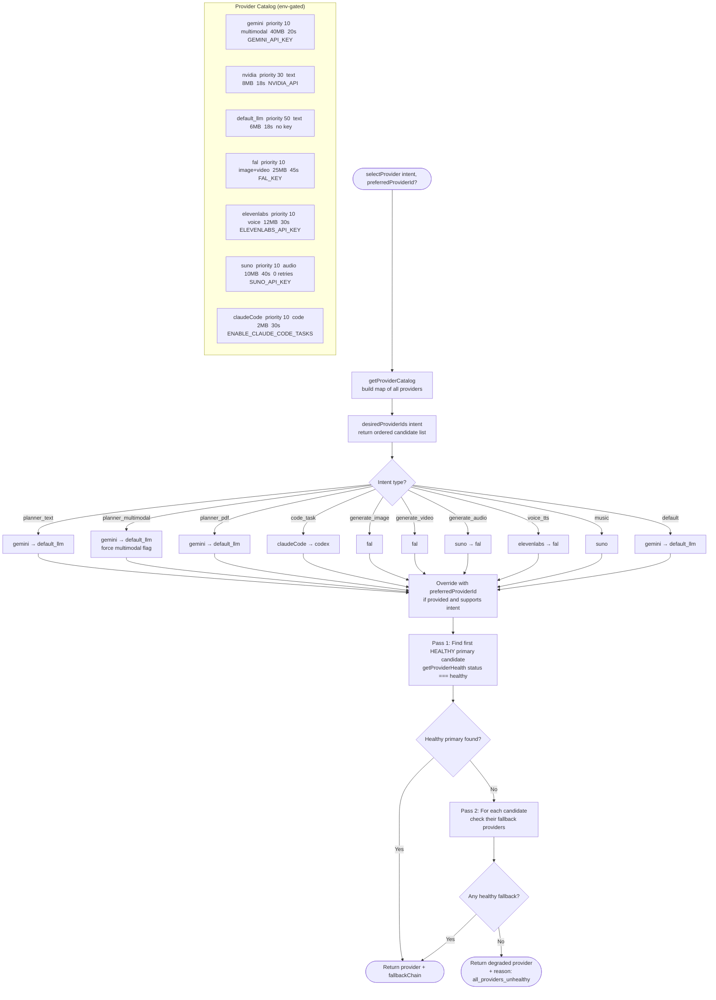

---

## 14. Orb Task Orchestrator — Dual State Sync

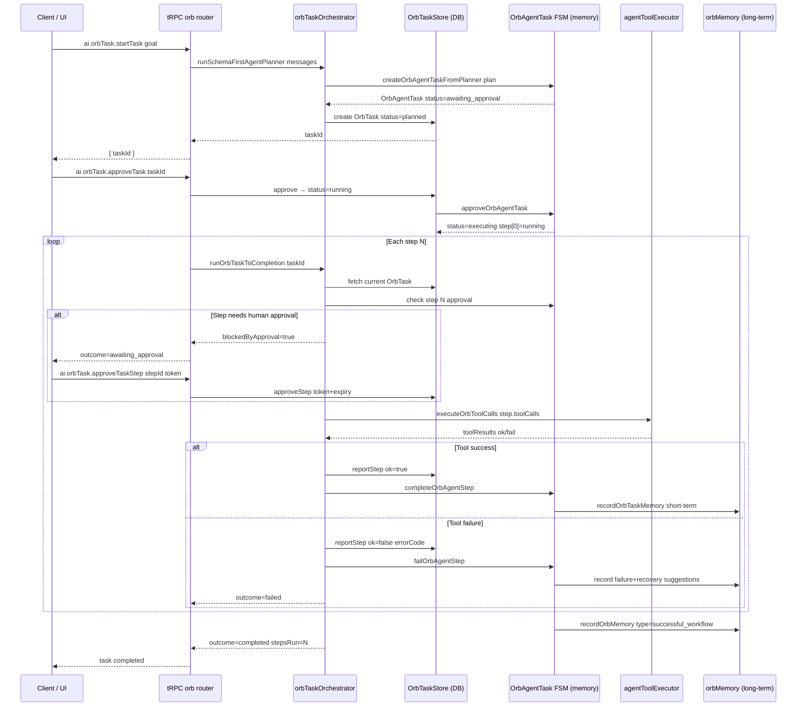

---

## 15. Authentication & Session — Complete Detail

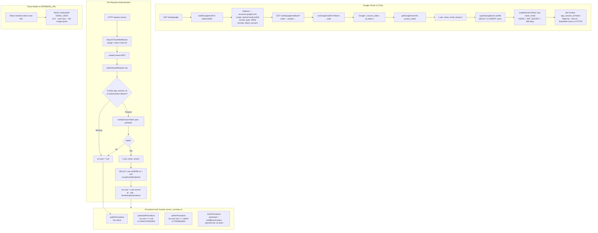

---

## 16. Feature Flags Reference

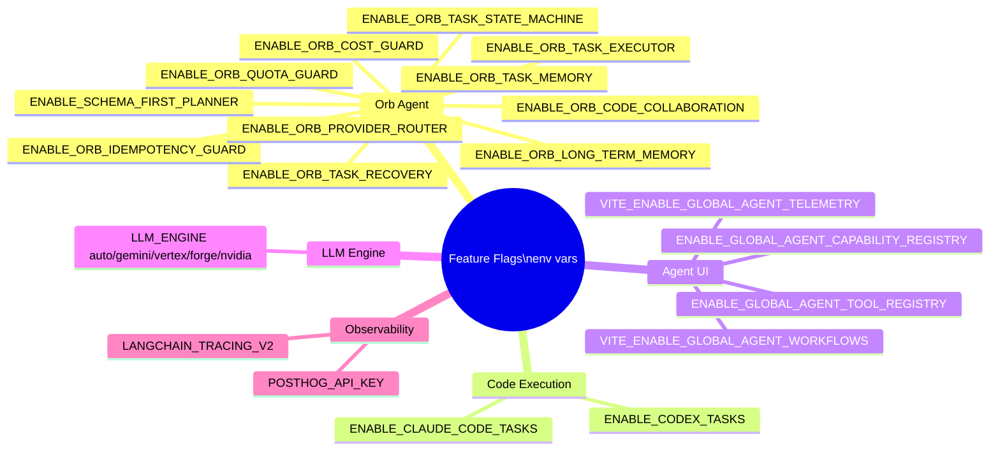

---

## 17. SSE Event Bus — Generation Real-Time Stream

```mermaid
sequenceDiagram
  participant C  as Client (React)
  participant GW as Express GET /api/generation-events/:jobId
  participant BUS as GenerationEventBus (EventEmitter)
  participant SVC as Service / Procedure

  C->>GW: GET /api/generation-events/42
  GW->>GW: Validate jobId (integer) → 400 if NaN
  GW->>C: Headers: Content-Type=text/event-stream\nCache-Control=no-cache\nX-Accel-Buffering=no
  GW->>C: data: {"type":"connected","jobId":42}

  GW->>BUS: subscribe("job:42", callback)
  Note over GW: Heartbeat every 15 s → ": heartbeat"
  Note over GW: Auto-close after 5 min (SSE_MAX_LIFETIME_MS)

  SVC->>BUS: emit(42, {type:"thought-update", node:{...}})
  BUS->>GW: callback fires
  GW->>C: data: {"type":"thought-update","node":{...}}

  SVC->>BUS: emit(42, {type:"progress", pct:60, message:"..."})
  BUS->>GW: callback fires
  GW->>C: data: {"type":"progress","pct":60}

  SVC->>BUS: emit(42, {type:"complete", chain:[...]})
  BUS->>GW: callback fires
  GW->>C: data: {"type":"complete","chain":[...]}
  Note over GW: 500 ms delay then close connection

  C-->>GW: disconnect
  GW->>BUS: unsubscribe("job:42")
  BUS->>BUS: cleanup(42) — remove all listeners

  Note over BUS: Max 100 concurrent listeners per instance\nChannel key pattern: "job:{jobId}"

  subgraph EVENT_TYPES["4 Event Types  (generationEvents.ts)"]
    T1["thought-update — reasoning node progress"]
    T2["progress — numeric % + message"]
    T3["complete — final thought chain array"]
    T4["error — error message"]
  end
```

---

## 18. Upload Route — File Upload Pipeline

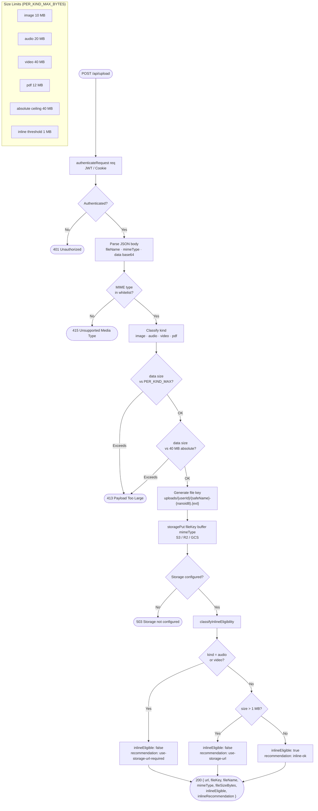

---

## 19. AI Proxy Gateway — /api/ai/:provider/*

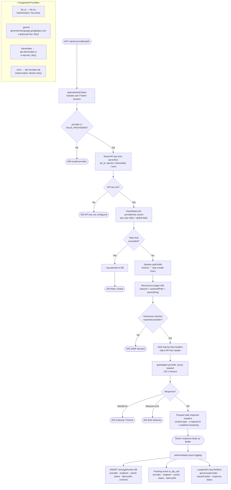

---

## 20. Media Download Proxy — SSRF Protection

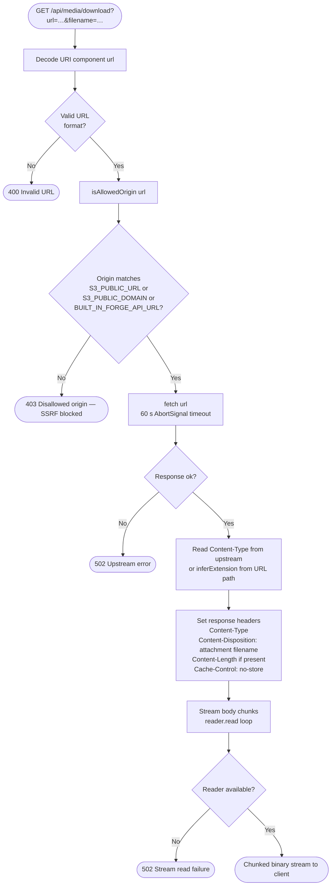

---

## 21. Orb Guard Chain — 4-Layer Safety Pipeline

```mermaid
flowchart TD
  A([User submits Orb task]) --> G1

  subgraph G1["Guard 1: orbIdempotency (orbIdempotency.ts)"]
    I1[buildOrbIdempotencyKey\nhash userId + text + attachmentUrls]
    I2{Duplicate found\nwithin 90 s?}
    I3[rememberTaskKey store hash → taskId]
    I1 --> I2
    I2 -->|Yes| IDUP([Return cached task — skip execution])
    I2 -->|No| I3
  end

  I3 --> G2

  subgraph G2["Guard 2: orbAttachmentGuard (orbAttachmentGuard.ts)"]
    A1[Scan message content parts\ntype=file_url or image_url]
    A2[inferKind mime\nimage · audio · video · pdf · unknown]
    A3{Kind = unknown?}
    A4{totalBytes > LIMITS kind?}
    A1 --> A2 --> A3
    A3 -->|Yes| AERR([Reject: unsupported format])
    A3 -->|No| A4
    A4 -->|Yes| AERR2([Reject: file too large\nimage 10MB audio 20MB video 40MB pdf 12MB])
    A4 -->|No| A5[Pass — totalBytes · kinds list]
  end

  A5 --> G3

  subgraph G3["Guard 3: orbCostGuard (orbCostGuard.ts)"]
    C1[Score intent:\noutput type · modality · duration\nassets · cross-page steps · provider · retries]
    C2{Cost tier?}
    C3["free / low → proceed silently"]
    C4["medium / high → requiresHuman = true"]
    C1 --> C2
    C2 --> C3
    C2 --> C4
    C4 --> CGATE{User confirmed?}
    CGATE -->|No| CERR([Block — show confirmation prompt in Chinese])
    CGATE -->|Yes| C5[Pass]
    C3 --> C5
  end

  C5 --> G4

  subgraph G4["Guard 4: orbQuota (orbQuota.ts)"]
    Q1{category?}
    Q1 -->|rapid_click| Q2["Sliding window 10 s\nmax 6 clicks per session"]
    Q1 -->|provider_rate| Q3["Sliding window 60 s\nmax 120 req/min per provider"]
    Q1 -->|planner| Q4[Daily counter max 200]
    Q1 -->|generation| Q5[Daily counter max 40]
    Q1 -->|multimodal_analysis| Q6[Daily counter max 30]
    Q1 -->|code_task| Q7[Daily counter max 12]
    Q1 -->|task_retry| Q8[Max 1 retry allowed]
    Q2 & Q3 & Q4 & Q5 & Q6 & Q7 & Q8 --> QR{Limit\nexceeded?}
    QR -->|Yes| QERR([429 Quota exceeded — reason message])
    QR -->|No| QPASS[Consume quota slot]
  end

  QPASS --> EXEC([Execute Orb task via orbTaskOrchestrator])
```

---

## 22. internalMedia — URL Localization Tree Walk

```mermaid
flowchart TD
  A([localizeResultUrls value prefix]) --> B{typeof value?}

  B -->|string| C{isInternalUrl?}
  C -->|Yes| SKIP([Return as-is — already local])
  C -->|No| D[persistExternalMediaUrl url]

  D --> D1[fetch url\n90 s AbortSignal timeout]
  D1 --> D2{Response ok?}
  D2 -->|No| ERR([Throw 下載外部媒體失敗])
  D2 -->|Yes| D3[arrayBuffer → Buffer]

  D3 --> D4[inferExtension contentType url category]
  D4 --> D4A{MIME type?}
  D4A -->|image/*| EXT1[png / webp / jpg / gif]
  D4A -->|video/*| EXT2[mp4 / webm]
  D4A -->|audio/*| EXT3[mp3 / wav / ogg]
  D4A -->|includes pdf| EXT4[pdf]
  D4A -->|none| EXT5[URL path suffix → category default]

  EXT1 & EXT2 & EXT3 & EXT4 & EXT5 --> D5["Generate key\n{prefix}/{timestamp}-{random}.{ext}"]
  D5 --> D6[storagePut key buffer contentType\nS3 / GCS]
  D6 --> LOCAL([Return S3/GCS public URL])

  B -->|array| ARR["Promise.all elements\n→ walk each item"]
  B -->|object| OBJ["Promise.all entries\n→ walk each value\npreserve keys"]

  ARR & OBJ --> B

  subgraph CLASSIFY["classifyByKey — infer category from key path"]
    K1["key contains 'voice' → voice"]
    K2["key contains 'audio' → audio"]
    K3["key contains 'video' → video"]
    K4["key contains image/thumbnail/mask/texture/pose → image"]
    K5["default → binary"]
  end

  subgraph IS_INTERNAL["isInternalUrl — skip if already internal"]
    P1["relative URL → internal"]
    P2["starts with S3_PUBLIC_URL → internal"]
    P3["starts with S3_PUBLIC_DOMAIN → internal"]
    P4["starts with BUILT_IN_FORGE_API_URL → internal"]
  end
```

---

## 23. brainAutoRepair — 5-Subsystem Self-Healing Architecture

```mermaid
graph TB
  subgraph SUBSYS1["Subsystem 1: API Health Monitor + Auto-Repair"]
    S1A["runHealthPatrol (called by cron)"]
    S1B["pingProvider endpoint\n8 s timeout\nreturns ok · latencyMs · error"]
    S1C["attemptAutoRepair engine"]
    S1D{"Provider\nhealthy?"}
    S1E["reportEngineRecovery\ncreate info alert"]
    S1F["Iterate ENGINE_FALLBACK_CHAIN\n~50 chains · ping each fallback"]
    S1G{"Fallback\nhealthy?"}
    S1H["Use fallback\ncreate warning alert"]
    S1I["All failed\ncreate critical alert\nrecordErrorTrace"]
    S1A --> S1B --> S1D
    S1D -->|Yes| S1E
    S1D -->|No| S1C --> S1F --> S1G
    S1G -->|Yes| S1H
    S1G -->|No| S1I
  end

  subgraph SUBSYS2["Subsystem 2: Error Trace + Diagnosis"]
    S2A["recordErrorTrace modality engine prompt error"]
    S2B["classifyError message + code\n10 categories · regex patterns"]
    S2C["enrichTraceWithDiagnosis\nerrorCategory · rootCause · confidence=85"]
    S2D["autoSearchForFix async\nfire-and-forget web search"]
    S2E["diagnoseError traceId\nfind related traces\nboost confidence +3 per related · max 95"]
    S2A --> S2B --> S2C --> S2D
    S2E -.->|on demand| S2A
  end

  subgraph SUBSYS3["Subsystem 3: Self-Reflection Proposals"]
    S3A["createReflectionProposal\ncategory · title · currentValue · proposedValue · confidence"]
    S3B["Status: pending → approved / rejected"]
    S3C["Admin reviews via brain.approveProposal\nor brain.rejectProposal"]
    S3A --> S3B --> S3C
  end

  subgraph SUBSYS4["Subsystem 4: Web Research"]
    S4A["webSearch query maxResults"]
    S4B{"Brave Search\nAPI key set?"}
    S4C["GET api.search.brave.com\nX-Subscription-Token header\nrelevance=80"]
    S4D["GitHub API fallback\nsearch repositories by stars\nrelevance = min(90, 50+stars/100)"]
    S4E["addResearchToLearnHub\nconvert to LearnDoc\ntags: 爬網研究 + keywords"]
    S4A --> S4B
    S4B -->|Yes| S4C --> S4E
    S4B -->|No| S4D --> S4E
  end

  subgraph SUBSYS5["Subsystem 5: Accuracy Testing"]
    S5A["runAccuracyTest engine testType testPrompt expected"]
    S5B["POST Gemini API\ntemperature=0.1 maxTokens=256 15 s timeout"]
    S5C{"Score by type"}
    S5D["response_quality: len 10-500 → 90"]
    S5E["latency: <3s → 95  <5s → 70  else → 40"]
    S5F["consistency: valid JSON → 95  else → 30"]
    S5G["error_rate: no error → 90  else → 20"]
    S5H{"score < 70?"}
    S5I["Auto-create ReflectionProposal\nvia createReflectionProposal"]
    S5A --> S5B --> S5C
    S5C --> S5D & S5E & S5F & S5G --> S5H
    S5H -->|Yes| S5I
  end

  subgraph STORAGE["In-Memory Stores (reset on restart)"]
    ST1["apiAlerts  max 200"]
    ST2["errorTraces  max 500"]
    ST3["reflectionProposals  max 100"]
    ST4["webResearchResults  max 200"]
    ST5["accuracyTests  max 200"]
  end

  S1E & S1H & S1I --> ST1
  S2A & S2C --> ST2
  S2D & S3A --> ST3
  S4A --> ST4
  S5A --> ST5

  subgraph ERROR_CATEGORIES["10 Error Categories (KNOWN_ERROR_PATTERNS)"]
    EC["rate_limit · auth_failure · connection · timeout\nmissing_api · broken_link · validation\nserver_error · quota_exceeded · model_unavailable · unknown"]
  end
```

---

## 24. Orb Memory Architecture — Long-term + Short-term

```mermaid
graph TB
  subgraph LONG_TERM["Long-Term Memory  (orbMemory.ts)"]
    LT_STORE["const store: OrbMemory[]\nIn-memory · no TTL by default\nnewest at index 0"]
    
    LT_WRITE["recordOrbMemory input"]
    LT_SANITIZE["sanitizeMemoryText summary\ncontainsSensitiveText → log as safety_event\nsanitizeMemoryMetadata metadata"]
    LT_ID["Generate memoryId\nmem_{timestamp}_{6-char hex}"]
    LT_PUSH["store.unshift record"]
    
    LT_READ["getRecentOrbMemories args"]
    LT_FILTER["Filter: ownership · expiry · type"]
    LT_SORT["Sort: descending createdAt"]
    LT_LIMIT["Clamp limit: 1-100"]
    
    LT_SEARCH["searchOrbMemories args"]
    LT_SUBSTR["Case-insensitive substring\non summary · tags · type"]
    LT_TOP["Return top 20"]
    
    LT_SUMMARIZE["summarizeOrbMemoriesForPlanner"]
    LT_SEGMENT["Segment by type:\nfailed_workflow · successful_workflow · tool_feedback"]
    LT_HINTS["Generate hints:\n≥2 failures → avoid pattern\n≥2 successes → prioritize similar"]
    
    LT_WRITE --> LT_SANITIZE --> LT_ID --> LT_PUSH --> LT_STORE
    LT_READ --> LT_FILTER --> LT_SORT --> LT_LIMIT
    LT_SEARCH --> LT_SUBSTR --> LT_TOP
    LT_SUMMARIZE --> LT_SEGMENT --> LT_HINTS
    LT_STORE --> LT_READ & LT_SEARCH & LT_SUMMARIZE
  end

  subgraph SHORT_TERM["Short-Term Task Memory  (orbTaskMemory.ts)"]
    ST_STORE["const memoryEvents: OrbTaskMemoryEvent[]\nFIFO buffer · max 300\nnewest at index 0"]
    
    ST_WRITE["recordOrbTaskMemory event"]
    ST_UNSHIFT["memoryEvents.unshift\nif length > 300 → pop oldest"]
    
    ST_READ["getRecentOrbTaskMemory limit"]
    ST_SLICE["slice(0, clamp(1-50))"]
    
    ST_SUMMARIZE["summarizeRecentOrbTaskMemoryForPlanner"]
    ST_COMPACT["Truncate fields:\nintent → 140 chars\nfailedReason → 160 chars\nactionTypes → max 8"]
    
    ST_WRITE --> ST_UNSHIFT --> ST_STORE
    ST_STORE --> ST_READ --> ST_SLICE
    ST_STORE --> ST_SUMMARIZE --> ST_COMPACT
  end

  subgraph MEMORY_TYPES["OrbMemoryType (11 types)"]
    MT["user_preference · successful_workflow · failed_workflow\nprompt_pattern · model_preference · style_preference\ntool_feedback · claude_code_task · codex_task\nsafety_event · recovery_event"]
  end

  subgraph EVENT_FIELDS["OrbTaskMemoryEvent fields"]
    EF["taskId · planId · traceId\nuserIntent (user's original request)\noutcome: success|failure|cancelled|blocked\nfailedReason · usedEngine\nusedMultimodalPlanner: boolean\nactionTypes: string[]"]
  end

  subgraph PLANNER_INJECTION["Injected into Agent Planner Context"]
    PI1["recentOrbMemorySummary → from summarizeOrbMemoriesForPlanner\n→ count · recent events · optimization hints"]
    PI2["recentTaskMemorySummary → from summarizeRecentOrbTaskMemoryForPlanner\n→ count · recent outcomes with reasons"]
  end

  LT_HINTS --> PI1
  ST_COMPACT --> PI2
  PI1 & PI2 --> PLANNER["agentPlanner.runSchemaFirstAgentPlanner\nInjected as context blocks in system prompt"]

---

## 25. LoRA Fine-Tuning Pipeline (Replicate)

```mermaid
flowchart TD
  A([User submits LoRA training request]) --> B["INSERT fineTunedModels\nstatus=pending\nconfigJson: triggerWord · epochs · learningRate · datasetImages"]
  B --> C["INSERT backgroundJobs\njobType=model_training · status=queued"]
  C --> D([Return modelId to client])

  subgraph CRON["modelTrainingWorker.ts — cron every 5 min"]
    E1["recoverStuckTrainingJobs\nCheck jobs stuck > 15 min\nQuery Replicate for status recovery"]
    E2["processQueuedTrainingJobs\nTake next 5 queued jobs\nMark as processing · fire runLoraTrainingJob async"]
    E1 --> E2
  end

  D -.->|cron picks up| CRON

  E2 --> F["runLoraTrainingJob modelId"]
  F --> F1["UPDATE status=training · progress=5%"]
  F1 --> F2["Build ZIP from datasetImages\nParse .jpg/.png/.webp extensions"]
  F2 --> F3["storagePut lora-datasets/{userId}/{modelId}-{ts}.zip\n→ S3 / GCS"]
  F3 --> F4["replicate.predictions.create\nmodel: ostris/flux-dev-lora-trainer\ninput_images: zipUrl\nsteps = epochs × 30\ncaption_prefix = triggerWord"]
  F4 --> F5["Store predictionId in\nfineTunedModels.replicatePredictionId\nbackgroundJobs.resultJson"]

  F5 --> POLL["Polling loop every 30 s\nmax 60 min"]
  POLL --> F6["replicate.predictions.get predictionId"]
  F6 --> F7{Status?}
  F7 -->|processing| F8["Update progress 30%→90% linear estimate"]
  F8 --> POLL
  F7 -->|succeeded| F9["Extract output trainedLoraUrl\nUPDATE fineTunedModels status=ready\ntrained_lora_url · file_url"]
  F7 -->|failed / canceled| F10["UPDATE fineTunedModels status=failed\nUPDATE backgroundJobs status=failed"]
  F9 --> F11([Model ready for injection])
  F10 --> ERR([Training failed])

  subgraph INJECTION["Injection into generate.multimodal"]
    I1["Load fineTunedModel WHERE id = fineTunedModelId"]
    I2{status = ready?}
    I3["Extract triggerWord from configJson\nPrepend to prompt:\ntriggerWord + original_prompt"]
    I4["Extract trainedLoraUrl as LoRA weights"]
    I5["Route image to fal-ai/lora\nloraUrl = weights\nloraScale = loraWeight ?? 0.8"]
    I1 --> I2 -->|Yes| I3 --> I4 --> I5
    I2 -->|No| IERR([Error: model not ready])
  end

  F11 -.->|user selects model in generation| INJECTION
```

---

## 26. Vault System — Character & Scene Reference Injection

```mermaid
flowchart TD
  subgraph VAULT_CRUD["Vault CRUD  (server/db.ts + vault router)"]
    V1["vault.list\nFilter by itemType character/scene\nSearch by name/tags"]
    V2["vault.create\nStore imageUrl · fileKey · tags · metadata\nTable: consistencyVault"]
    V3["vault.update  name · tags · imageUrl · metadata"]
    V4["vault.delete  ownership check"]
    V5["vault.exportToAssets\nCopy to digital_asset_library"]
  end

  subgraph VAULT_DATA["consistencyVault table"]
    VD["id · userId · name\nitemType: character | scene\nimageUrl · fileKey\ntags JSON · metadata JSON\ncreatedAt · updatedAt"]
  end

  subgraph INJECTION["Vault Injection in generate.multimodal"]
    A[Input: vaultCharacterId] --> B[db.getVaultItem vaultCharacterId]
    B --> B1{itemType?}
    B1 -->|character + video| C1[Inject → characterRefUrl\nfirstFrameUrl]
    B1 -->|character + image| C2[Inject → styleReferenceUrl]

    D[Input: vaultSceneId] --> E[db.getVaultItem vaultSceneId]
    E --> F[Inject → vibeReferenceUrl]
  end

  subgraph DOWNSTREAM["Downstream Effect in Prompt Compilation"]
    G["compileElitePrompt injects reference image metadata"]
    H["Calculate visualWeight 0.0-1.0\nbased on number of reference types"]
    I["Generate controlNetParams\nfor downstream model integration"]
    G --> H --> I
  end

  C1 & C2 & F --> G
  VAULT_CRUD --> VAULT_DATA
```

---

## 27. generate.multimodal — Complete 9-Stage Pipeline

```mermaid
flowchart TD
  A([generate.multimodal called with jobId]) --> S1

  subgraph S1["Stage 1: Load Brain Config"]
    L1["Read userAiBrain from brainContext"]
    L2["Resolve engine per modality:\nimage: Gemini | Fal.ai\nvideo: Gemini Veo | Fal.ai\naudio: Gemini Lyria | Suno/Fal.ai\nvoice: Gemini TTS | ElevenLabs/Fal.ai"]
    L3["Calculate cost estimate via modelPricing"]
    L1 --> L2 --> L3
  end

  S1 --> S2

  subgraph S2["Stage 2: Safety Check"]
    SC1["checkSafety prompt\nGemini LLM · 15 s timeout\nJSON schema { safe, reason }"]
    SC2["Emit SSE: thought-update safety queued→processing"]
    SC3{safe?}
    SC4["Emit SSE: safety passed"]
    SC5["Refund points to user\nEmit SSE: error\nThrow TRPC error"]
    SC1 --> SC2 --> SC3
    SC3 -->|Yes| SC4
    SC3 -->|No| SC5
  end

  S2 --> S3

  subgraph S3["Stage 3: Vault Injection"]
    V1["If vaultCharacterId → db.getVaultItem\n→ inject characterRefUrl / styleReferenceUrl"]
    V2["If vaultSceneId → db.getVaultItem\n→ inject vibeReferenceUrl"]
  end

  S3 --> S4

  subgraph S4["Stage 4: Fine-Tuned Model Injection"]
    FM1["If fineTunedModelId → load model\nVerify status = ready"]
    FM2["Extract triggerWord from configJson\nPrepend to prompt: triggerWord + prompt"]
    FM3["Extract trainedLoraUrl as LoRA weights"]
    FM1 --> FM2 --> FM3
  end

  S4 --> S5

  subgraph S5["Stage 5: RAG Memory Retrieval"]
    R1["buildMemoryContext userId prompt\n3 s timeout · non-blocking\nSemantic context from past generations"]
  end

  S5 --> S6

  subgraph S6["Stage 6: Prompt Compilation"]
    PC1["compileElitePrompt:\n- Inject vibe card descriptions\n- Inject reference image metadata\n- Inject RAG memory context\n- Inject brain storyteller config\n- LLM expand prompt to 2048 tokens max"]
    PC2["Calculate visualWeight 0.0-1.0"]
    PC3["Generate controlNetParams"]
    PC4["Emit SSE: compile processing → completed\nwith compiledPrompt.length tokens"]
    PC1 --> PC2 --> PC3 --> PC4
  end

  S6 --> S7

  subgraph S7["Stage 7: Modality-Specific Generation"]
    G1{generationType?}
    G1 -->|image| GI["Gemini generateImage\nOR falDispatcher text-to-image\nIF LoRA → fal-ai/lora + loraScale\nIF refImage → image-to-image"]
    G1 -->|video| GV["Gemini generateVideoSync 5 min max\nOR falDispatcher video model\nSupports firstFrameUrl + lastFrameUrl anchors"]
    G1 -->|audio| GA["Gemini Lyria/MusicFX generateAudio\nOR Suno/Fal.ai audioCompiler\nLyrics + instrumental flag"]
    G1 -->|voice| GVo["Gemini TTS textToSpeech\nOR ElevenLabs/Fal.ai voiceCompiler\nSSML prosody + emotion profiling"]
    GI & GV & GA & GVo --> PU["persistExternalMediaUrl\nlocalizeResultUrls → S3/GCS"]
    PU --> RD["resultData: imageUrl / videoUrl / audioUrl / voiceUrl"]
  end

  S7 --> S8

  subgraph S8["Stage 8: History & Telemetry"]
    H1["INSERT generationHistory\nresultData · vaultIds · modelUsed · pointsDeducted\napiProvider · responseStatus"]
    H2["INSERT apiUsageLogs\npoints · engine · success/failure"]
    H3["INCREMENT fineTunedModel.usageCount async non-blocking"]
    H1 --> H2 --> H3
  end

  S8 --> S9

  subgraph S9["Stage 9: SSE Completion"]
    E1["Emit thought-update: generate completed"]
    E2["Emit thought-update: quota points breakdown"]
    E3["Emit thought-update: history queued"]
    E4["Emit progress: 100%"]
    E5["Emit complete: full thoughtChain array"]
    E1 --> E2 --> E3 --> E4 --> E5
  end

  S9 --> DONE([Client receives result via SSE])
```

---

## 28. Media Compiler Services — Voice / Audio / Video

```mermaid
graph TB
  subgraph VOICE["voiceCompiler.ts — SSML + Emotion Prosody"]
    VC_IN["Input: script · moodBlock · vibeCardIds\nvoiceId · rateOverride · enableHesitation"]
    VC_1["Map moodBlock → EmotionProfile\n13 profiles: serene · warm · dreamy · joyful\nmystical · nature · vintage · minimal\nmelancholy · dramatic · tender · anxious · contemplative"]
    VC_2["Segment script:\nnarration | dialogue | pause"]
    VC_3["Apply SSML prosody tags\nprosody rate pitch volume\nbreak time hesitation breaks"]
    VC_OUT["Output: ssml · plainText · emotionProfile\nsegmentCount · estimatedDurationSec\nbreakCount · compilationLog"]
    VC_IN --> VC_1 --> VC_2 --> VC_3 --> VC_OUT
  end

  subgraph AUDIO["audioCompiler.ts — Suno Music Structure"]
    AC_IN["Input: blocks AudioBlock[]\nfreePrompt · moodKeywords · lyrics\ntargetDurationSec · instrumental\nbpmOverride · forceStructure"]
    AC_1["Select template:\npop · ambient · edm · ballad\ncinematic · lofi · minimal"]
    AC_2["Generate sections:\nIntro · Verse 1 · Chorus · Drop\nBridge · Outro\n(energy level 1-5 per section)"]
    AC_3["Stack tags: max 4 per section bracket\nResolve style conflicts (e.g. heavy metal + ambient)"]
    AC_OUT["Output: prompt · styleTag · sections[]\nsectionCount · estimatedDurationSec\nhasConflictResolution · compilationLog"]
    AC_IN --> AC_1 --> AC_2 --> AC_3 --> AC_OUT
  end

  subgraph VIDEO["videoCompiler.ts — Camera Motion + Emotion Translation"]
    VVC_IN["Input: prompt · moodBlock\nfirstFrameUrl · lastFrameUrl\nfirstFrameDesc · lastFrameDesc\ncameraMode · aspectRatio"]
    VVC_1["Emotion-to-Action Translator\nMap emotion → actionVerbs · subjectBehaviors\nenvironmentalCues · suggestedCamera"]
    VVC_2["Camera Vector Binding\n16 modes: static · dolly_in/out · pan_left/right\ntilt_up/down · orbit · crane_up/down\ntracking · handheld · aerial · push_in · pull_out\nstability score 1-5 per mode"]
    VVC_3["Frame Anchoring:\nfirstFrameUrl → lock opening shot\nlastFrameUrl → lock closing shot"]
    VVC_4["Generate shots[] with transition safety\nPrevent jarring camera cuts"]
    VVC_OUT["Output: prompt · shots[] · shotCount\ncameraMode · cameraStabilityScore\nfirstFrameAnchor · lastFrameAnchor\nemotionTranslations · compilationLog"]
    VVC_IN --> VVC_1 --> VVC_2 --> VVC_3 --> VVC_4 --> VVC_OUT
  end

  subgraph GEMINI_MEDIA["geminiMedia.ts — Google Multimodal API"]
    GM_IMG["generateImage\nModels: imagen-3.0-generate-002 · imagen-3.0-fast · imagen-2.0\nParams: prompt · aspectRatio · negativePrompt · seed · numImages\n→ base64 images"]
    GM_VID["generateVideoSync\nModels: veo-2.0-generate-001 · veo-3.0-generate-preview\nParams: prompt · imageUrl firstFrame · duration 5-8s\nPolling up to 300 s → operationName → videoUrl"]
    GM_AUD["generateAudio\nModels: lyria-002 · musicfx-001\nParams: prompt · duration ≤30s · seed · temperature\n→ base64 audio"]
    GM_TTS["textToSpeech\nModels: gemini-2.5-flash-preview-tts · gemini-2.5-pro-preview-tts\nVoices: Zephyr · Puck · Charon · Kore · Fenrir · Aoede · Leda · Orus\nParams: text · voiceName · language · speakingRate 0.25-4.0 · pitch -20 to +20\n→ base64 audio"]
  end

  VC_OUT -->|ElevenLabs / Fal.ai TTS| GEMINI_MEDIA
  AC_OUT -->|Suno / Fal.ai audio| GEMINI_MEDIA
  VVC_OUT -->|Fal.ai / Gemini Veo| GEMINI_MEDIA
