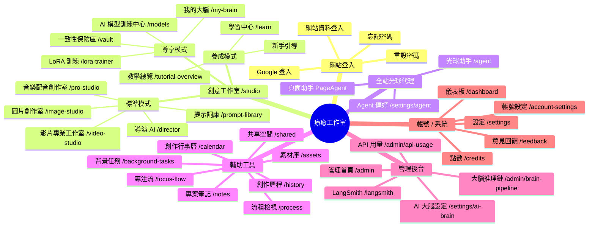

# Healing Studio 全站關係圖

> 風格：以「網站登入 → 創意工作室 → 模式 → 助手代理 → 功能模組」為主軸的階層樹。
>
> 本文件兩種圖：
> 1. `mindmap` — 心智圖樣貌（最接近 XMind 風格）
> 2. `flowchart` — 帶實際路徑與黃色便利貼註解的詳細圖
>
> 路由清單來源：`client/src/App.tsx`（30+ 條 `<Route>`）

---

## 1. 全站心智圖（mindmap）



---

## 2. 詳細路由圖（含黃色便利貼註解）

```mermaid
flowchart TD
  classDef note fill:#FFF4B8,stroke:#E0C200,color:#5C4A00
  classDef page fill:#E8F0FF,stroke:#3B82F6,color:#1E3A8A
  classDef mode fill:#FCE7F3,stroke:#DB2777,color:#831843
  classDef agent fill:#DCFCE7,stroke:#16A34A,color:#14532D
  classDef admin fill:#FEE2E2,stroke:#DC2626,color:#7F1D1D

  %% --- 登入 ---
  Login["網站登入"]:::page
  Login --> GLogin["Google 登入<br/>OAuth"]:::page
  Login --> SLogin["網站資料登入<br/>本地帳密"]:::page
  Login -. 忘記密碼 .-> Forgot["/forgot-password"]:::page
  Forgot --> Reset["/reset-password"]:::page

  %% --- 創意工作室 ---
  GLogin --> Studio["/studio<br/>創意工作室"]:::page
  SLogin --> Studio

  Studio --> ModeA["養成模式"]:::mode
  Studio --> ModeB["標準模式"]:::mode
  Studio --> ModeC["尊享模式"]:::mode

  %% --- 養成模式 ---
  ModeA --> Tutorial["/tutorial-overview<br/>教學總覽"]:::page
  ModeA --> Learn["/learn<br/>學習中心"]:::page
  NoteA["黃色註記：養成模式<br/>給新手引導使用<br/>含教學動畫"]:::note
  ModeA -.-> NoteA

  %% --- 標準模式 ---
  ModeB --> ImgStudio["/image-studio<br/>圖片創作室"]:::page
  ModeB --> VidStudio["/video-studio<br/>影片專業工作室"]:::page
  ModeB --> ProStudio["/pro-studio<br/>音樂配音創作室"]:::page
  ModeB --> Director["/director<br/>導演 AI"]:::page
  ModeB --> Prompts["/prompt-library<br/>提示詞庫"]:::page

  %% --- 尊享模式 ---
  ModeC --> Models["/models<br/>AI 模型訓練中心"]:::page
  ModeC --> Lora["/lora-trainer<br/>LoRA 訓練"]:::page
  ModeC --> Vault["/vault<br/>一致性保險庫"]:::page
  ModeC --> MyBrain["/my-brain<br/>我的大腦"]:::page
  NoteC["黃色註記：尊享模式<br/>含付費功能<br/>需訂閱"]:::note
  ModeC -.-> NoteC

  %% --- 全站光球代理 ---
  Studio -. 浮動使用 .-> Orb["全站光球代理<br/>Global Orb"]:::agent
  Orb --> AgentChat["/agent<br/>光球助手"]:::agent
  Orb --> PageAgent["PageAgent<br/>各頁助理"]:::agent
  Orb --> AgentPref["/settings/agent<br/>Agent 偏好"]:::agent
  NoteOrb["黃色註記：光球橫跨全站<br/>監聽當前頁面 context<br/>可呼叫工具與工作流"]:::note
  Orb -.-> NoteOrb

  %% --- 輔助工具 ---
  Studio --> Calendar["/calendar<br/>創作行事曆"]:::page
  Studio --> Focus["/focus-flow<br/>專注流"]:::page
  Studio --> Shared["/shared<br/>共享空間"]:::page
  Studio --> Notes["/notes<br/>專案筆記"]:::page
  Studio --> Assets["/assets<br/>素材庫"]:::page
  Studio --> BgTasks["/background-tasks<br/>背景任務"]:::page
  Studio --> History["/history<br/>創作歷程"]:::page
  Studio --> Process["/process<br/>流程檢視"]:::page

  %% --- 管理後台 ---
  Admin["/admin<br/>管理後台"]:::admin
  Admin --> AdminApi["/admin/api-usage<br/>API 用量"]:::admin
  Admin --> AdminPipe["/admin/brain-pipeline<br/>大腦推理鏈"]:::admin
  Admin --> BrainSet["/settings/ai-brain<br/>AI 大腦設定"]:::admin
  Admin --> LangSmith["/langsmith<br/>LangSmith Tracing"]:::admin
  NoteAdmin["黃色註記：僅 admin 權限可進入<br/>監控 LLM 推理 / 用量 / 成本"]:::note
  Admin -.-> NoteAdmin

  %% --- 帳號系統 ---
  Studio --> Dashboard["/dashboard<br/>儀表板"]:::page
  Studio --> Account["/account-settings<br/>帳號設定"]:::page
  Studio --> Credits["/credits<br/>點數"]:::page
  Studio --> Settings["/settings<br/>系統設定"]:::page
  Studio --> Feedback["/feedback<br/>意見回饋"]:::page
```



---

## 3. 後端對應索引

| 前端 | 對應後端 / 文件 |
|---|---|
| 全站光球代理 | `docs/global-orb-*.md`、`docs/AGENT_CONDITIONS_AUDIT.md` |
| AI 大腦設定 / 推理鏈 | `docs/AI_BRAIN_OVERVIEW.md`、`docs/BRAIN_CONFIGURATION.md` |
| 全站節點對照 | `docs/fullstack-node-level-map-2026-04-29.zh-TW.md` |
| 連線健康檢查 | `docs/connection-audit-2026-04-29.md` |
| 外部供應商 | `docs/external-api-supplier-audit-2026-04-23.md` |
| API 用量管理 | `docs/admin-api-usage.md` |

---

## 4. 預覽與匯出

**VS Code 預覽**
```bash
# 安裝擴充：Markdown Preview Mermaid Support
# 開啟此檔後按 Cmd+Shift+V（macOS）或 Ctrl+Shift+V（Win/Linux）
```

**GitHub 預覽**：直接 push 到分支，於 web 介面開啟此 `.md` 即自動渲染。

**匯出 SVG / PNG**
```bash
npx -p @mermaid-js/mermaid-cli mmdc \
  -i docs/SITE_MAP.md \
  -o docs/site-map.svg \
  -t neutral -b transparent
```

**互動心智圖（可摺疊）**
```bash
npx markmap-cli docs/SITE_MAP.md
```

---

## 5. 之後若要升級為應用內互動頁

專案已安裝 `@xyflow/react` + `dagre`，可直接 fork `AiBrainPipelinePage` 模式：

| 既有檔案 | 用途 |
|---|---|
| `client/src/pages/AiBrainPipelinePage.tsx` | 頁面殼參考 |
| `client/src/components/brain-pipeline/PipelineCanvas.tsx` | XYFlow 主畫布 |
| `client/src/components/brain-pipeline/useDagreLayout.ts` | 自動佈局 |
| `client/src/components/brain-pipeline/PipelineNodeCard.tsx` | 自訂節點卡（可改成黃色便利貼樣式） |

建議新增：
- `client/src/pages/SiteMapPage.tsx`
- `client/src/components/site-map/SiteMapCanvas.tsx`
- `shared/site-map.ts`（純 TS 節點資料，**同時餵給 Mermaid 與 XYFlow**，避免雙軌不同步）
- 在 `App.tsx` 新增 `<Route path="/site-map" component={SiteMapPage} />`

---

## 6. 維護規則

1. 新增頁面 → 同步在 §2 flowchart 加節點，並在 `App.tsx` 加 `<Route>`。
2. 黃色便利貼 (`classDef note`) 用於補充「業務語意 / 使用情境」，**不寫實作細節**。
3. 三模式（養成 / 標準 / 尊享）的歸屬若有調整，先改本文件再改程式碼，確保文件先行。
