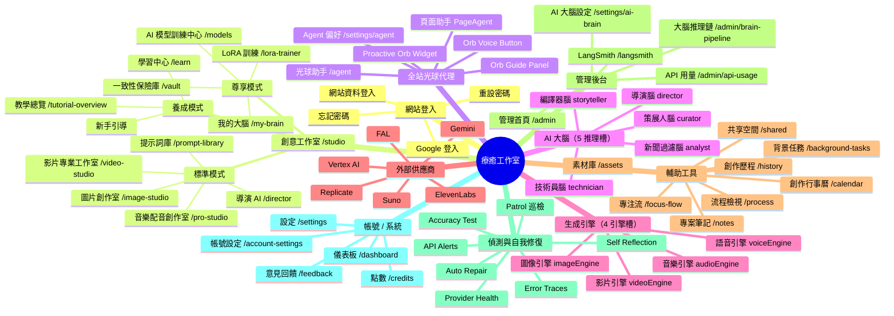
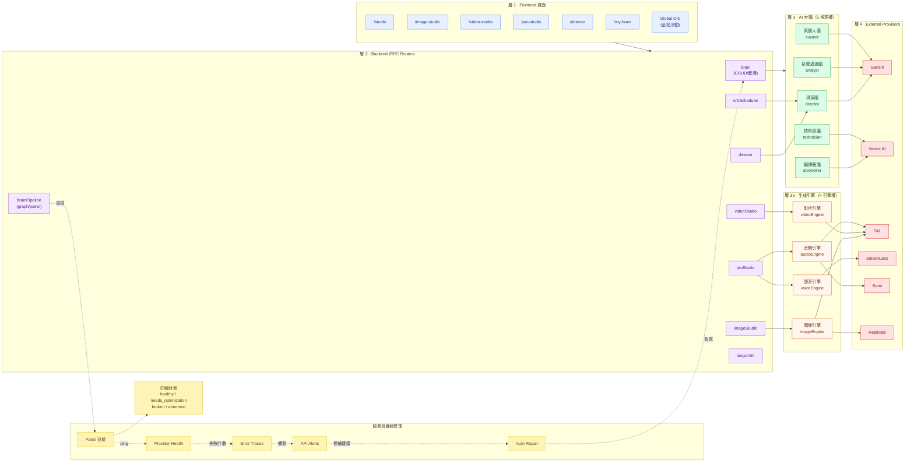
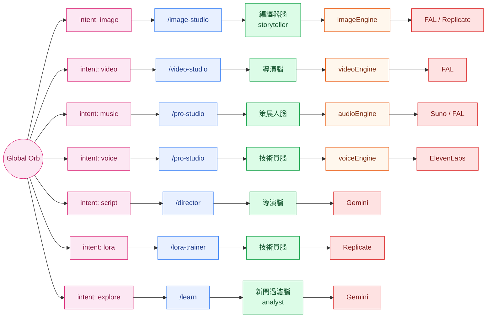
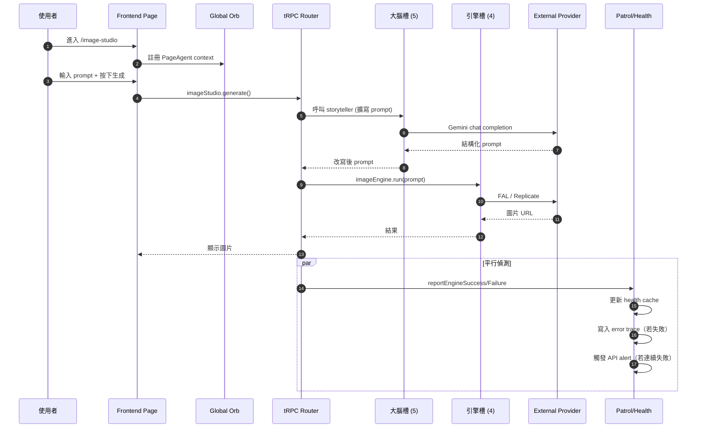
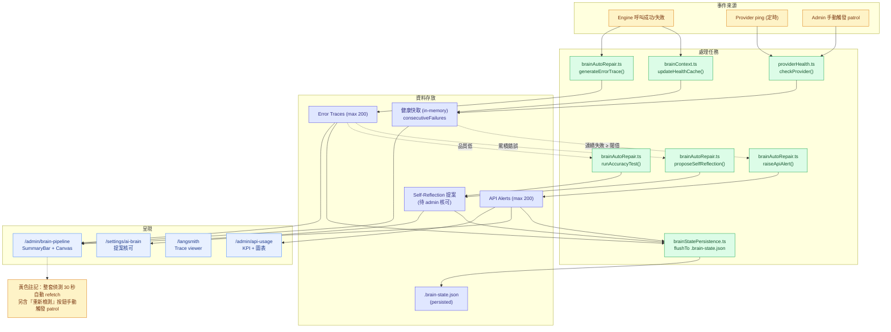

# Healing Studio 全站關係圖

> 風格：以「網站登入 → 創意工作室 → 模式 → 助手代理 → 功能模組 → 大腦/引擎 → 外部供應商」貫穿的階層+遙測圖。
>
> 本文件包含：
> 1. `mindmap` 全站心智圖（XMind 風格）
> 2. `flowchart` 詳細路由圖 + 黃色便利貼註解
> 3. **大腦推理鏈 4 層遙測架構**（含偵測 / 健康 / 自我修復）
> 4. **光球代理 ↔ 大腦槽 ↔ 引擎 ↔ 供應商**對應
> 5. **各創作室 → 大腦/引擎 觸發路徑**
> 6. **偵測與健康狀態系統**（patrol / autoRepair / langsmith）
> 7. **資料流序列圖**（使用者請求一路到供應商再回傳）
>
> 路由清單來源：`client/src/App.tsx`（30+ 條 `<Route>`）
> 大腦節點來源：`shared/brain-pipeline.ts`、`server/routers/brainPipeline.ts`

---

## 1. 全站心智圖（mindmap）



---

## 2. 詳細路由圖（含黃色便利貼註解）

```mermaid
flowchart TD
  classDef note fill:#FFF4B8,stroke:#E0C200,color:#5C4A00
  classDef page fill:#E8F0FF,stroke:#3B82F6,color:#1E3A8A
  classDef mode fill:#FCE7F3,stroke:#DB2777,color:#831843
  classDef agent fill:#DCFCE7,stroke:#16A34A,color:#14532D
  classDef admin fill:#FEE2E2,stroke:#DC2626,color:#7F1D1D

  %% --- 登入 ---
  Login["網站登入"]:::page
  Login --> GLogin["Google 登入<br/>OAuth"]:::page
  Login --> SLogin["網站資料登入<br/>本地帳密"]:::page
  Login -. 忘記密碼 .-> Forgot["/forgot-password"]:::page
  Forgot --> Reset["/reset-password"]:::page

  %% --- 創意工作室 ---
  GLogin --> Studio["/studio<br/>創意工作室"]:::page
  SLogin --> Studio

  Studio --> ModeA["養成模式"]:::mode
  Studio --> ModeB["標準模式"]:::mode
  Studio --> ModeC["尊享模式"]:::mode

  %% --- 養成模式 ---
  ModeA --> Tutorial["/tutorial-overview<br/>教學總覽"]:::page
  ModeA --> Learn["/learn<br/>學習中心"]:::page
  NoteA["黃色註記：養成模式<br/>給新手引導使用<br/>含教學動畫"]:::note
  ModeA -.-> NoteA

  %% --- 標準模式 ---
  ModeB --> ImgStudio["/image-studio<br/>圖片創作室"]:::page
  ModeB --> VidStudio["/video-studio<br/>影片專業工作室"]:::page
  ModeB --> ProStudio["/pro-studio<br/>音樂配音創作室"]:::page
  ModeB --> Director["/director<br/>導演 AI"]:::page
  ModeB --> Prompts["/prompt-library<br/>提示詞庫"]:::page

  %% --- 尊享模式 ---
  ModeC --> Models["/models<br/>AI 模型訓練中心"]:::page
  ModeC --> Lora["/lora-trainer<br/>LoRA 訓練"]:::page
  ModeC --> Vault["/vault<br/>一致性保險庫"]:::page
  ModeC --> MyBrain["/my-brain<br/>我的大腦"]:::page
  NoteC["黃色註記：尊享模式<br/>含付費功能<br/>需訂閱"]:::note
  ModeC -.-> NoteC

  %% --- 全站光球代理 ---
  Studio -. 浮動使用 .-> Orb["全站光球代理<br/>Global Orb"]:::agent
  Orb --> AgentChat["/agent<br/>光球助手"]:::agent
  Orb --> PageAgent["PageAgent<br/>各頁助理"]:::agent
  Orb --> AgentPref["/settings/agent<br/>Agent 偏好"]:::agent
  NoteOrb["黃色註記：光球橫跨全站<br/>監聽當前頁面 context<br/>可呼叫工具與工作流"]:::note
  Orb -.-> NoteOrb

  %% --- 輔助工具 ---
  Studio --> Calendar["/calendar<br/>創作行事曆"]:::page
  Studio --> Focus["/focus-flow<br/>專注流"]:::page
  Studio --> Shared["/shared<br/>共享空間"]:::page
  Studio --> Notes["/notes<br/>專案筆記"]:::page
  Studio --> Assets["/assets<br/>素材庫"]:::page
  Studio --> BgTasks["/background-tasks<br/>背景任務"]:::page
  Studio --> History["/history<br/>創作歷程"]:::page
  Studio --> Process["/process<br/>流程檢視"]:::page

  %% --- 管理後台 ---
  Admin["/admin<br/>管理後台"]:::admin
  Admin --> AdminApi["/admin/api-usage<br/>API 用量"]:::admin
  Admin --> AdminPipe["/admin/brain-pipeline<br/>大腦推理鏈"]:::admin
  Admin --> BrainSet["/settings/ai-brain<br/>AI 大腦設定"]:::admin
  Admin --> LangSmith["/langsmith<br/>LangSmith Tracing"]:::admin
  NoteAdmin["黃色註記：僅 admin 權限可進入<br/>監控 LLM 推理 / 用量 / 成本"]:::note
  Admin -.-> NoteAdmin

  %% --- 帳號系統 ---
  Studio --> Dashboard["/dashboard<br/>儀表板"]:::page
  Studio --> Account["/account-settings<br/>帳號設定"]:::page
  Studio --> Credits["/credits<br/>點數"]:::page
  Studio --> Settings["/settings<br/>系統設定"]:::page
  Studio --> Feedback["/feedback<br/>意見回饋"]:::page
```



---

## 3. 大腦推理鏈架構（4 層遙測）

> 對應檔案：`shared/brain-pipeline.ts`、`server/routers/brainPipeline.ts`、`client/src/pages/AiBrainPipelinePage.tsx`
>
> 這是「大腦可視化」的真實節點分層 — 同一張圖既是站內結構，也是即時健康監測（綠/黃/紅/灰四色狀態）。



**節點 status 色票**（同 `PipelineNodeCard.tsx`）：

| 狀態 | 顏色 | 含義 |
|---|---|---|
| `healthy` | 綠 | 正常運作 |
| `needs_optimization` | 黃 | 可運作但建議優化（成本高、慢、品質） |
| `broken` | 紅 | 失敗 / API down |
| `abnormal` | 灰 | 未知 / 待巡檢 |

---

## 4. 光球代理 ↔ 大腦槽 ↔ 引擎 ↔ 供應商

> 來源：`client/src/contexts/OrbGuideContext.tsx`（intent 對應）、`docs/global-orb-capability-registry.md`、`docs/global-orb-executor.md`

光球的 7 個 intent 直接決定要點亮哪條腦+引擎+供應商鏈：



**Orb 元件對照**（`client/src/components/`）：

| 元件 | 角色 |
|---|---|
| `ProactiveOrbWidget.tsx` | 全站浮動光球本體 |
| `OrbGuidePanel.tsx` | intent 選擇 + 引導對話 |
| `orb/OrbVoiceButton.tsx` | 語音輸入鈕 |
| `OrbGuideContext.tsx` | intent → 頁面 + 自動填表 actions |

**後端**：`server/routers/orbScheduler.ts` 把 intent 轉成可執行的 task，丟到對應的 brain slot；任務狀態機見 `docs/global-orb-task-state-machine.md`。

---

## 5. 各創作室 → 大腦/引擎 觸發路徑（Sequence）

實際使用者按下「生成」按鈕的完整呼叫鏈：



對於 4 個主要創作室，把上面 sequence 的 router/brain/engine/provider 換成下表對應即可：

| 創作室 | tRPC Router | 主要大腦 | 引擎 | 供應商 |
|---|---|---|---|---|
| 圖片創作室 | `imageStudio` | storyteller | `imageEngine` | FAL / Replicate |
| 影片專業工作室 | `videoStudio` | director | `videoEngine` | FAL |
| 音樂創作（pro-studio） | `proStudio` | curator | `audioEngine` | Suno / FAL |
| 配音（pro-studio） | `proStudio` | technician | `voiceEngine` | ElevenLabs |
| 導演 AI | `director` | director | — | Gemini |
| LoRA 訓練 | `loraTrainer` | technician | — | Replicate |

---

## 6. 偵測與健康狀態系統

> 來源：`server/services/brainAutoRepair.ts`、`server/services/providerHealth.ts`、`server/middleware/brainContext.ts`、`server/services/brainStatePersistence.ts`



**核心 API**（皆在 `trpc.brainPipeline`）：

| API | 用途 |
|---|---|
| `getGraph()` | 完整 admin 視圖（pages + routers + brain + engine + provider + alerts） |
| `getMyGraph()` | 個人化視圖（僅該使用者的 5 推理腦 + 4 引擎 + orb/director） |
| `getSummary()` | KPI 卡片用的輕量 summary |
| `runPatrol()` | 立即 ping 所有供應商 + 重整健康快取 |

---

## 7. 後端對應索引

| 前端 | 對應後端 / 文件 |
|---|---|
| 全站光球代理 | `server/routers/orbScheduler.ts`、`docs/global-orb-*.md`、`docs/AGENT_CONDITIONS_AUDIT.md` |
| 大腦推理鏈視覺化 | `server/routers/brainPipeline.ts`、`shared/brain-pipeline.ts`、`docs/AI_BRAIN_OVERVIEW.md` |
| AI 大腦設定 | `server/routers/brain.ts`、`docs/BRAIN_CONFIGURATION.md` |
| 偵測 / 自我修復 | `server/services/brainAutoRepair.ts`、`server/services/providerHealth.ts`、`server/services/brainStatePersistence.ts` |
| 全站節點對照 | `docs/fullstack-node-level-map-2026-04-29.zh-TW.md` |
| 連線健康檢查 | `docs/connection-audit-2026-04-29.md` |
| 外部供應商 | `docs/external-api-supplier-audit-2026-04-23.md` |
| API 用量管理 | `server/routers/apiUsage.ts`、`docs/admin-api-usage.md` |
| LangSmith 追蹤 | `server/routers/langsmith.ts` |
| 圖片創作室 | `server/routers/imageStudio.ts` |
| 影片創作室 | `server/routers/videoStudio.ts` |
| 音樂/配音創作室 | `server/routers/proStudio.ts` |
| 導演 AI | `server/routers/director.ts` |
| LoRA 訓練 | `server/routers/loraTrainer.ts` |

---

## 8. 預覽與匯出

**VS Code 預覽**：安裝 *Markdown Preview Mermaid Support*，按 `Cmd+Shift+V`（macOS）/ `Ctrl+Shift+V`（Win/Linux）。

**GitHub 預覽**：push 後在 web 介面開啟此 `.md` 即自動渲染。

**匯出 SVG / PNG**
```bash
npx -p @mermaid-js/mermaid-cli mmdc \
  -i docs/SITE_MAP.md \
  -o docs/site-map.svg \
  -t neutral -b transparent
```

**互動心智圖（可摺疊）**
```bash
npx markmap-cli docs/SITE_MAP.md
```

---

## 9. 升級為應用內 XYFlow 互動頁

**選項 A — 獨立分頁（推薦給初次嘗試）**

新增 `/site-map` 路由，純展示用，不接 health 資料：

| 新增檔案 | 用途 |
|---|---|
| `client/src/pages/SiteMapPage.tsx` | 頁面殼，fork `AiBrainPipelinePage` |
| `client/src/components/site-map/SiteMapCanvas.tsx` | XYFlow 畫布 |
| `shared/site-map.ts` | **純 TS 節點資料**（同時餵 Mermaid 與 XYFlow） |
| `App.tsx` | 加 `<Route path="/site-map" component={SiteMapPage} />` |

**選項 B — 整合進大腦推理鏈頁面（推薦給生產用）**

直接擴充 `AiBrainPipelinePage.tsx`，把 page/page-group 節點納入既有 graph，與 brain/engine/provider 同畫布顯示。優點：
- 共用同一份 health 偵測（綠/黃/紅/灰即時上色）
- 點擊某 page 節點 → 反推它觸發哪些 brain/engine（連線高亮）
- 加上「站點視圖 / 大腦視圖 / 完整視圖」三個 tab，切換 layer 顯示

**實作建議**：在 `shared/brain-pipeline.ts` 的 `kind` 加 `page`、`page-group`（其實已有），在 `server/routers/brainPipeline.ts:getGraph()` 把 `client/src/App.tsx` 的 routes 也輸出成節點，再用 `useDagreLayout` 一起佈局。這樣**完全不需要新頁面**，現有的 `/admin/brain-pipeline` 就直接變成全站關係圖 + 健康監測二合一。

> 你問題裡的「放入大腦可視化可以當分頁或是直接彙整加入偵測功能」——
> **建議走選項 B**，因為兩者本來就共用同一份節點型別 (`PipelineNode.kind`)，直接整合可省一份維護。

---

## 10. 維護規則

1. 新增頁面 → 同步在 §2 flowchart 加節點，並在 `App.tsx` 加 `<Route>`。
2. 黃色便利貼 (`classDef note`) 用於補充「業務語意 / 使用情境」，**不寫實作細節**。
3. 三模式（養成 / 標準 / 尊享）的歸屬若有調整，先改本文件再改程式碼，確保文件先行。
4. 新增大腦槽 / 引擎槽 / 供應商 → 同步更新 `shared/brain-pipeline.ts` 與本文件 §3、§4、§5。
5. 偵測機制有變動（新增 alert 來源、新增自我修復策略）→ 更新 §6 流程圖。
6. 若選擇本文件「§9 選項 B」整合方案，本文件改為**從 `shared/site-map.ts` 自動產生 Mermaid**（避免手動雙軌）。
